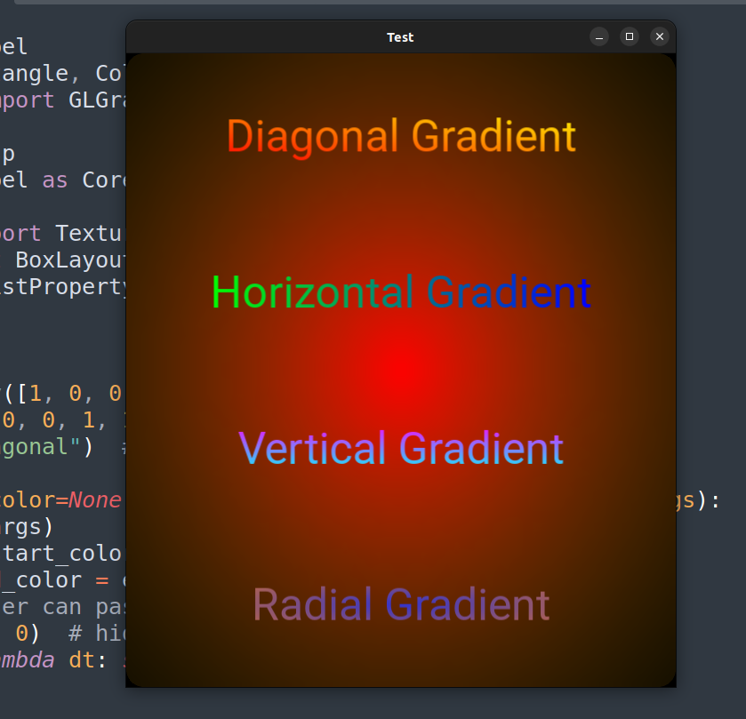

# GradientLabel
# 🌈 Gradient Label for Kivy

A custom Kivy Label widget with beautiful gradient text rendering, supporting horizontal, vertical, diagonal, and radial gradients.

This project uses Gradient4Kivy for GPU-accelerated gradient textures combined with CoreLabel masks for text rendering.

---

## ✨ Features
- Gradient text (horizontal / vertical / diagonal / radial)
- Works with any font size
- Customizable colors (start_color, end_color)
- Supports alignment (halign, valign)
- Background gradients with GLGradient

---

## 📦 Installation

1. Install Kivy (if not already installed):
   pip install kivy

2. Install Gradient4Kivy:
   pip install gradient4kivy

3. Install NumPy (used for blending):
   pip install numpy

---

## 🚀 Usage

### Example (with KV file)

```python
from kivy.app import App
from kivy.lang import Builder
from gradientlabel import GradientLabel  # import the custom widget

KV = '''
BoxLayout:
    orientation: "vertical"
    padding: "10dp"
    spacing: "10dp"

    GradientLabel:
        text: "Diagonal Gradient"
        font_size: "50sp"
        mode: "diagonal"
        start_color: 1, 0, 0, 1   # red
        end_color: 1, 1, 0, 1     # yellow
        halign: "center"
        valign: "middle"
'''

class TestApp(App):
    def build(self):
        return Builder.load_string(KV)

if __name__ == "__main__":
    TestApp().run()
```

## 📷 Screenshot

Here's what the app looks like:
<p align="center">
   
</p>

